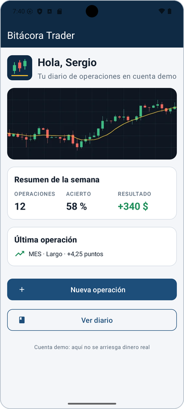
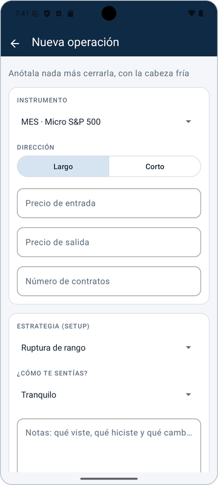
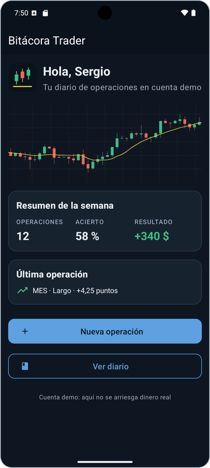
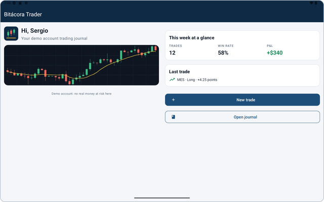
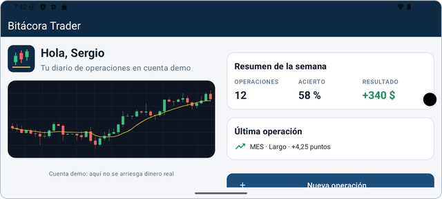
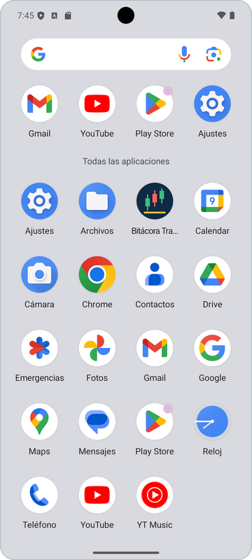

<p align="center">
  
</p>

# Bitácora Trader

**Práctica 1 · Programación Multimedia y Dispositivos Móviles (2.º DAM, MEDAC)**
Autor: Sergio Mitchell Bocero

Bitácora Trader es una app Android para llevar un diario de las operaciones de futuros que se hacen en una cuenta demo. Al cerrar una operación se anotan el instrumento, la dirección, los precios, los contratos, la estrategia, cómo te sentías y unas notas; la pantalla de inicio muestra el resumen de la semana (operaciones, % de acierto y resultado) y la última operación.

En esta práctica se diseña la interfaz y se organizan todos los recursos del proyecto; la funcionalidad (guardar y calcular operaciones) no está programada todavía.

## Capturas

| Pantalla principal | Nueva operación | Tema oscuro |
|---|---|---|
|  |  |  |

| En inglés (tablet) | En horizontal (móvil) |
|---|---|
|  |  |

Icono propio en el cajón de aplicaciones:



## Qué incluye el proyecto

- **Java + vistas XML**, plantilla Empty Views Activity, `minSdk 24`, `targetSdk 35`, paquete `es.medac.sergiomitchell.app`.
- **Dos pantallas**: `MainActivity` (inicio) y `NuevaOperacionActivity` (formulario).
- **Textos** en `res/values/strings.xml` (33 textos traducibles, 3 `string-array` y textos con parámetros `%1$s`), **traducidos al inglés** en `res/values-en`, con idioma por app (`localeConfig`) en Android 13+.
- **Paleta propia** en `colors.xml` con nombres de función (`color_primario`, `color_ganancia`, `color_perdida`…).
- **Estilos propios** reutilizados (`Estilo.Titulo`, `Estilo.Boton.Principal`, `Estilo.Tarjeta`, `Estilo.Campo`…) y tema `Theme.BitacoraTrader` basado en Material 3.
- **Medidas** en `dimens.xml`: dp para tamaños y sp para textos.
- **Imágenes**: vectores (logotipo e iconos) y un mapa de bits WebP en `drawable-nodpi` (gráfico de velas).
- **Icono adaptativo** creado con Image Asset a partir de SVG propios (`docs/icono/`): fondo, primer plano y capa monocroma en `mipmap-*`.
- **Ampliaciones**: tema oscuro (`values-night`) y diseño horizontal (`layout-land`).

## Cómo ejecutarla

1. Clona el repositorio:
   ```bash
   git clone https://github.com/sergiomitbo/PMDM_P1_SergioMitchell.git
   ```
2. En Android Studio: **File → Open** y elige la carpeta `PMDM_P1_SergioMitchell`. Espera a que termine la sincronización de Gradle (la primera vez descarga Gradle 8.9 y las dependencias).
3. Crea o elige un dispositivo virtual en **Device Manager** (probado en un Pixel 8 y una Medium Tablet, ambos con API 35).
4. Pulsa **Run ▶** (Mayús + F10).

La app sigue el idioma del sistema: en inglés usa `values-en` y en cualquier otro idioma, español (*Settings → System → Languages*). En Android 13+ también se puede elegir solo para esta app (*Ajustes → Aplicaciones → Bitácora Trader → Idioma*). El tema oscuro se activa en *Ajustes → Pantalla → Tema oscuro*.

## Memoria

La memoria completa (análisis, especificación, entorno y recursos) está en [`docs/memoria.pdf`](docs/memoria.pdf).
